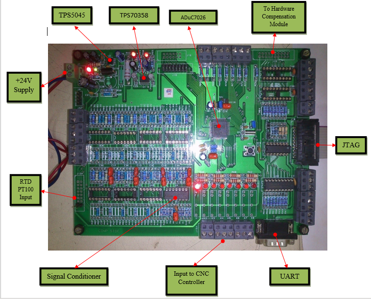

# Design and Development of an Micro-Controller based Embedded Controller

## Mr Nitin Nandeshwar
### 13 June 2012

## Introduction:
An ARM7 Micro-Controller based embedded controller has been designed and developed to compute Thermal error compensation value basically meant for Machine Tool Applications. The controller has an interface to Temperature sensors on one end and Computerized Numerical Controller (CNC) on the other end. This controller has an interface to connect about 8 Temperature sensors.

## Conclusion
A proto-type PCB was manufactured so as to Test the functionality of the designed Hardware. The PCB is assembled and tested for the following functionalities.
*   Power Supply module generating 5V DC, 3.3V DC and 2.5V DC supply from 24VDC power supply.
*   JTAG Emulator Interface.
*   Resistive Temperature Detecting RTD Interface with Signal Conditioning and (PT100) as the sensing element
*   UART Communication Interface
*   General Purpose Input / Output Interface
*   An Interface to Communicate with Computerized Numerical Controller (CNC) with a Relay Logic and so on

The developed PCB Module functionality is
All the above mentioned functionalities are tested and found to be working satisfactorily.
